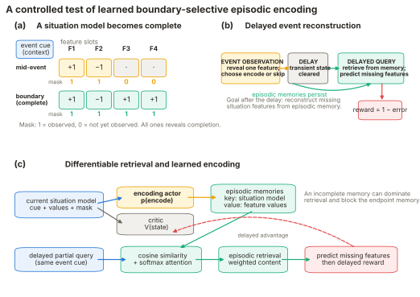
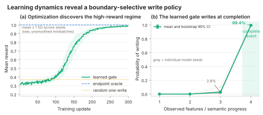
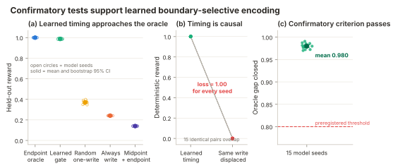
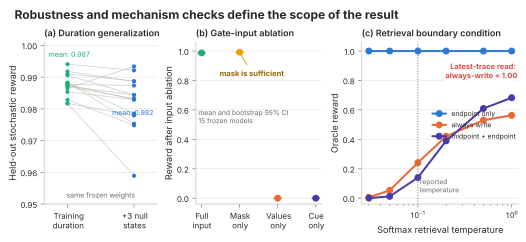

# Can Optimization Discover Event-Boundary Encoding?

## A controlled differentiable episodic-memory feasibility study

> **Report status:** complete measured synthetic experiment, 2026-08-30 
> **Implementation and report:** Codex, with scientific direction from Qihong Lu 
> **Review notice:** human review by a domain expert is strongly recommended before
> scientific publication. All numbers below are measured executions of the released
> synthetic task; they are not human data and are not hand-written illustrations.

## Abstract

Lu, Hasson, and Norman (2022) argued that selective episodic encoding at event
boundaries can be resource-rational because it reduces interference from incomplete
memories. Their encoding schedules were imposed rather than learned. We test the
stronger computational claim that delayed reward can teach a model when to write to
episodic memory. Each synthetic event reveals four independent binary features in a
random order. A write gate observes the random event cue, accumulated feature values,
and their observation mask, but no explicit boundary label or remaining-time input.
At delayed test, a partial query retrieves a softmax-weighted mixture from a
content-addressable memory and reward is one minus reconstruction error for missing
features. Exact enumeration first established that endpoint-only writing is the
unique optimum. A Bernoulli actor–critic then learned from delayed reward alone. In a
frozen 15-seed confirmatory evaluation, the stochastic policy achieved reward
0.987 ± 0.004 and endpoint selectivity 0.985 ± 0.006; all 15 seeds were selective.
It closed 0.980 [0.977, 0.983] of the matched-random-to-oracle reward gap, and
displacing its deterministic endpoint write to the midpoint reduced reward from
1.000 to 0.000 in every seed. The result demonstrates computational feasibility in
this controlled task. Mechanism analyses also sharply limit the claim: the gate can
solve the task from the explicit completion mask alone, and latest-trace retrieval
removes the advantage of selective encoding.

## 1. Question and relation to the original model

The original [eLife article](https://doi.org/10.7554/eLife.74445) developed a
resource-rational account of episodic-memory control. Its retrieval gate was learned,
whereas its encoding analysis compared experimenter-specified policies. The article
explicitly identified learned encoding as future work: selective storage should in
principle be learnable, but credit must span the delay between storage and later
retrieval, and encoding can interact with retrieval quality. The accompanying
[learn-hippo repository](https://github.com/qihongl/learn-hippo) operationalized
boundary encoding with an encoding interval and showed that adding a mid-event trace
could impair later prediction.

This study isolates that unresolved learning question. It is not a reimplementation
of the full multi-event LSTM. Instead, it asks whether an optimizer can discover one
specific policy when the environment is constructed so that this policy is known to
be useful. The simplification is deliberate: a negative result would implicate
delayed credit assignment rather than uncertainty about task structure, and a
positive result establishes only feasibility, not generality or psychological
identity.

**Figure 1. Controlled task and computational flow.** During study, one feature is
revealed at each semantic step and the gate may store the current partial state. The
controller is reset before a delayed partial query. The memory read is differentiable;
the write is a discrete Bernoulli action trained from delayed advantage. This is a
measured synthetic-task schematic, not a diagram of a biological circuit.

## 2. Task design

An event contains a normalized six-dimensional random cue and four independently
sampled features in \(\{-1,+1\}\). A random permutation determines reveal order.
After each reveal, the observable state contains the accumulated feature vector
\(x_t\), with zero in unrevealed locations, and a binary mask \(m_t\). The policy input
is

\[
s_t=[c;x_t;m_t],
\]

where \(c\) is the event cue. There is no `is_boundary` bit, absolute timestep,
remaining-time variable, or access to withheld feature values. The semantic endpoint
is simply the first state for which all entries of \(m_t\) equal one.

At delayed test, transient controller state is cleared. The query contains the same
cue and the state after the first two reveals. The other two features are targets.
This geometry makes selective writing theoretically useful. If the exact two-feature
study state was stored, it is more similar to the delayed query than the complete
endpoint is, but it does not contain either target feature. Soft competitive retrieval
can therefore favor an incomplete trace and suppress the useful endpoint. Storing
only the endpoint avoids this interference without relying on a write penalty or
capacity eviction.

The primary task has four informative study states. The duration-generalization test
inserts three null states at reproducibly sampled positions before semantic
completion, making seven physical states while leaving the completion rule intact.
Training, exploratory validation, confirmatory evaluation, and mechanism analysis
use disjoint seed namespaces. Every test episode resamples cue, feature values, reveal
order, and null-state positions where applicable.

## 3. Memory and policy

Each selected study state creates a distinct key–value trace. A key concatenates the
event cue, accumulated values, and mask; the value is the accumulated feature state.
For query \(q\), key \(k_i\), and temperature \(\tau\), the differentiable read is

\[
a_i=\frac{\exp(\cos(q,k_i)/\tau)}{\sum_j\exp(\cos(q,k_j)/\tau)},
\qquad r=\sum_i a_i v_i.
\]

Here \(a_i\) is attention to trace \(i\), \(v_i\) is that trace's value, and \(r\)
is the retrieved feature vector. The reported condition fixes \(\tau=0.1\) and a
four-slot capacity, sufficient to retain every possible trace. If no trace exists,
the read is the declared zero vector. Reward is

\[
R=1-\frac{1}{|H|}\sum_{j\in H}(r_j-x_j^*)^2,
\]

where \(H\) is the set of two withheld features and \(x^*\) is the complete event.

The trainable write controller is a two-layer multilayer perceptron with 32 tanh
units per layer, followed by a Bernoulli actor and scalar critic head. At each study
state, it samples \(z_t\sim\mathrm{Bernoulli}(p_t)\). If \(z_t=1\), the state is
appended to episodic memory. A shared delayed return trains all study actions. With
critic estimate \(V(s_t)\), the policy term is

\[
L_{actor}=-\frac{1}{T}\sum_t \log p(z_t\mid s_t)
\left(R-V(s_t)\right),
\]

combined with a half-squared critic loss and an entropy bonus. Thus the read is
differentiable, but the distinct write decision is optimized with policy gradients,
not ordinary backpropagation through a fractional write.

One architectural fact is essential for interpretation: the retriever has no
learned key projection or trainable parameters. The staged “supervised retrieval”
and joint retrieval/write phases in the broader research plan collapse here to
deterministic validation of the cosine-softmax operator. Likewise, no supervised
endpoint labels enter RL training. A supervised gate and straight-through fractional
write were retained as possible diagnostics but were not needed to establish the
primary delayed-reward result and are not reported as evidence.

## 4. Experimental protocol

The experiment proceeded in an order that prevented a favorable learned result from
defining the task. First, all \(2^4=16\) deterministic write schedules were evaluated
on 256 paired episodes under both fixed-capacity and the historical schedule-scaled
capacity convention. Only after the endpoint policy was verified as the unique
optimum was actor–critic learning run. Three model seeds (0–2) were used for
exploratory configuration selection. The confirmatory YAML then froze the unchanged
training settings and model seeds 100–114 before their test episodes were examined.

Each confirmatory model received 300 updates with 64 episodes per update, learning
rate 0.003, critic coefficient 0.5, entropy coefficient 0.005, and gradient-norm
clipping at 1.0. Frozen weights were evaluated on 1,024 unseen episodes per seed.
The model seed—not the episode—is the inferential unit. The same episode banks were
used for paired baselines. Fixed-seed percentile bootstrap intervals use 10,000
resamples and seed 20260830. The preregistered criteria required at least 12 of 15
positive-selectivity seeds, a selectivity interval above zero, at least 0.80 closure
of the random-to-oracle gap, and a displacement-loss interval above zero.

The run executed with PyTorch 2.13.0 on macOS 26.6.2 arm64. Configuration hashes,
execution commits, all seed-level aggregate metrics, and complete training curves
are stored with the results. Checkpoints are intentionally excluded from Git, while
compact JSON evidence is versioned.

## 5. Results

### 5.1 The task has the intended optimum

Endpoint-only writing (`0001`) was the unique best schedule, with reward 1.000 and a
0.267 margin over the next deterministic schedule. Matched random one-write achieved
0.375 in the oracle audit; always-write achieved 0.241; midpoint-plus-endpoint
achieved 0.140; midpoint-only and never-write achieved 0.000. Both capacity
conventions produced the same ranking because no eligible trace was evicted. This
validates the theoretical precondition, but it is not evidence of policy learning.

**Figure 2. Optimization trajectory and learned timing.** The left panel shows raw,
unsmoothed minibatch rewards, summarized as mean ± one standard deviation over all
15 confirmatory seeds. The right panel shows each model's write probability, with
bootstrap 95% intervals over model seeds. All values are measured synthetic results.

### 5.2 Delayed reward teaches selective endpoint writing

Across the 15 confirmatory seeds, stochastic held-out reward was 0.987 ± 0.004,
95% interval [0.986, 0.989]. Endpoint-minus-nonendpoint write probability was
0.985 ± 0.006, interval [0.982, 0.988], and boundary AUC was 1.000 for every seed.
All 15 seeds had positive selectivity. Thresholding at 0.5 produced exactly one
endpoint write and reward 1.000 for every model.

The learned stochastic policy closed 0.980 of the paired gap between matched random
one-write and the endpoint oracle, interval [0.977, 0.983], exceeding the frozen 0.80
criterion. The learned policy was not merely sparse: moving the deterministic write
from endpoint to midpoint while holding count fixed reduced reward from 1.000 to
0.000 in every seed. All four preregistered checks passed.

| Method or intervention | Reward mean | SD over model seeds |
|---|---:|---:|
| Endpoint-only oracle | 1.000 | 0.000 |
| Learned deterministic gate | 1.000 | 0.000 |
| Learned stochastic gate | 0.987 | 0.004 |
| Matched random one-write | 0.371 | 0.015 |
| Always write | 0.241 | 0.000 |
| Midpoint + endpoint | 0.140 | 0.000 |
| Displaced learned write | 0.000 | 0.000 |

**Figure 3. Confirmatory evidence across all model seeds.** Open markers show seeds;
solid markers show means with bootstrap 95% intervals. The causal intervention uses
the deterministic learned action and displaces its single write. All values are
measured synthetic results.

### 5.3 The gate generalizes by semantic progress

Without retraining, adding three null states yielded stochastic reward 0.982 ± 0.009,
interval [0.978, 0.986], and endpoint selectivity 0.986 ± 0.005. Because the endpoint
now occurs at different physical positions, this rules out a policy that simply
counts to four. It does not rule out detection through the observation mask.

## 6. What behavior did optimization actually discover?

Post-confirmatory analyses used new episode seeds and did not change the success
audit. Mean write probability was 0.000005 after one observed feature, 0.000049 after
two, 0.028 after three, and 0.994 after all four. The transition is therefore tied to
semantic completion rather than gradually increasing elapsed time.

The most diagnostic input ablation is also the strongest limitation. With cue and
feature values zeroed, mask-only input preserved reward at 0.992 ± 0.005 and
selectivity at 0.991 ± 0.005. Values-only and cue-only inputs produced no
deterministic writes and reward 0.000. The network learned that an all-ones mask is
the profitable write state. It received no explicit boundary label, but it did not
infer latent boundaries from an unsegmented sensory stream.

Retrieval ablations locate why the policy helps. Endpoint-only reward remained 1.000
at every softmax temperature. Always-write reward increased from 0.006 at
\(\tau=0.03\) to 0.563 at \(\tau=1.0\), while midpoint-plus-endpoint increased from
approximately 0.000 to 0.683. Replacing competitive soft retrieval with a
latest-trace oracle made always-write reward 1.000. The selective policy is therefore
optimal for this retriever because incomplete traces interfere; it is not universally
optimal across memory architectures.

**Figure 4. Robustness and mechanism boundaries.** The duration panel pairs the same
frozen model across original and longer episodes. Input ablations and retrieval
manipulations are explicitly post-confirmatory. All plotted values are measured
synthetic results.

## 7. Conclusions and limits

The narrow research question has a positive answer: in a short environment where
endpoint-only storage is independently proven optimal, a discrete episodic write
gate can learn that policy from delayed prediction reward across unseen event cues,
feature mappings, reveal orders, and longer durations. The result closes the exact
technical gap highlighted in the 2022 article at a minimal scale: the encoding
schedule need not be supplied by the experimenter.

Several stronger claims do not follow. The task has one event at a time, a transparent
completion mask, independent binary features, and a fixed nonparametric retriever.
It does not test latent event segmentation, multi-event credit assignment, learned
retrieval/encoding coordination, arbitrary memory capacity, a full recurrent event
model, or human behavior. Model attention is only an analogue of reinstatement, not
human gaze or hippocampal retrieval. The result also depends on retrieval competition;
another retriever can make dense writing equally good.

The next decisive study should remove the explicit completion mask and introduce
multiple variable-length events with learned latent state, while retaining an oracle
audit that proves boundary storage is useful. A second step should add trainable
retrieval so encoding and retrieval must co-adapt. Those extensions would test the
broader resource-rational claim rather than the present proof of feasibility.

## 8. Reproduction and evidence map

- Environment and memory: `src/boundary_em/task.py`, `memory.py`, and `oracle.py`.
- Policy and training: `src/boundary_em/policy.py`, `training.py`, and
  `policy_training.py`.
- Frozen confirmatory configuration: `configs/learned_encoding/reported.yaml`.
- Oracle result: `outputs/learned_encoding/oracle_results.json`.
- Fifteen seed files: `outputs/learned_encoding/reported/`.
- Confirmatory aggregate: `outputs/learned_encoding/reported_summary.json`.
- Post-confirmatory mechanisms: `outputs/learned_encoding/mechanism_results.json`.
- Figure sources and vector exports: `outputs/learned_encoding/figures/`.
- Data contract and decision history: `docs/learned_encoding/data_contract.md` and
  `docs/learned_encoding/decision_log.md`.

## References

1. Lu, Q., Hasson, U., & Norman, K. A. (2022). *A neural network model of
   when to retrieve and encode episodic memories*. eLife, 11, e74445.
   <https://doi.org/10.7554/eLife.74445>
2. Lu, Q. (2022). *learn-hippo: code and simulation instructions for Lu et al.
   (2022)*. <https://github.com/qihongl/learn-hippo>
