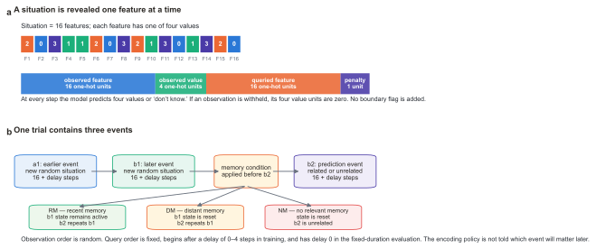
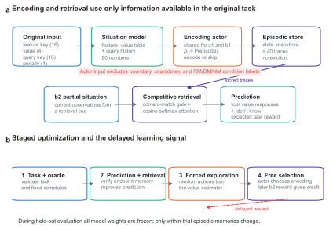
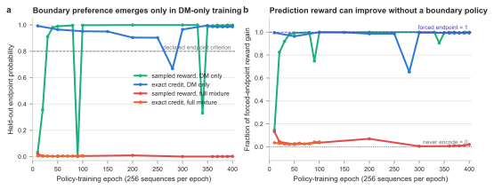
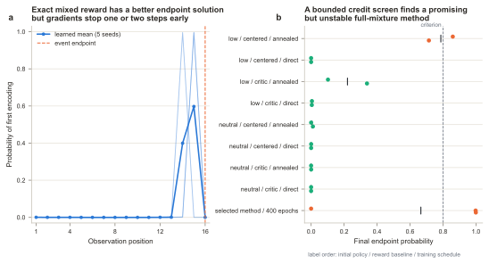
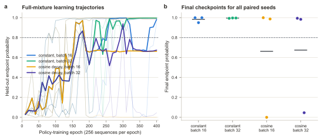
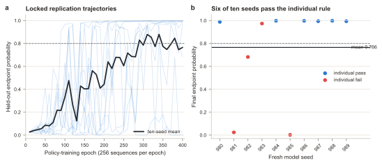

# Learning an Event-Boundary Encoding Policy on the Original Event-Prediction Task

## A differentiable episodic-memory study of the Lu--Hasson--Norman simulation

> **Report status:** completed exploratory study with measured synthetic
> simulations, updated 2026-09-01
>
> **Implementation and report:** Codex, with scientific direction from Qihong Lu
>
> **Scope:** the task generator follows the released prediction-task code for Lu,
> Hasson, and Norman (2022). The encoding and episodic-memory mechanisms are new.
>
> **Review notice:** human review by a domain expert is strongly recommended before
> scientific publication. Every number below was measured by executing a synthetic
> model simulation; none is human behavioral data or a hand-written placeholder.

## Abstract

Lu, Hasson, and Norman (2022) showed that an episodic memory encoded at an
**event boundary** can support later prediction better than a memory encoded before
the event is complete. Their model's encoding times were imposed by the
experimenter. We asked whether optimization can instead teach a differentiable
episodic-memory system when to encode. We reproduced the released task: each event
is a randomly ordered stream of 16 categorical features, predictions lag
observations by zero to four steps, and later prediction may require reinstating a
previous event. For debugging, observed feature values were accumulated exactly.
A two-layer neural policy then chose whether to encode the current situation; it
received no boundary, time, event-identity, future-relevance, or memory-condition
label. Soft content-based retrieval was differentiable, and the discrete encoding
choice was learned either from exact expected reward or from sampled delayed
prediction reward.

The basic feasibility result is positive and reproducible in a simplified
distant-memory (DM) condition. Across ten fresh policies, each trained on 102,400
newly generated sequences, mean endpoint-encoding probability was 0.999895 and all
ten were stable over their final five evaluations. On unseen mappings, mean
prediction reward was 0.6616, compared with 0.4870 for never encoding and 0.5139
for one random encoding. Removing the relevant memory reduced reward to 0.4833.
Restoring the released variable delays and missing observations made discovery
unreliable: seven of ten policies finished above 0.80 endpoint probability, six
were stable, and the mean was 0.7055 (SD 0.4346).

The full-task result remains negative. The endpoint was the best deterministic
shared encoding time in five exact audits of the released 0.25 recent-memory, 0.25
DM, and 0.50 no-relevant-memory mixture, yet gradient optimization converged one or
two steps early. A bounded credit-assignment screen found a promising method, but a
400-epoch follow-up was unstable: two of three fresh policies ended near 1.0
endpoint probability, while the third collapsed from 0.999 at epoch 390 to nearly
zero at epoch 400. A predeclared optimizer screen then crossed constant versus
decaying learning rates with batches of 16 versus 32 sequences. Only the constant-
rate, batch-32 cell passed all three paired seeds; its final endpoint probabilities
were 0.9929, 0.9969, and 0.9965. However, two seeds had large earlier excursions,
and a locked ten-seed replication failed: mean endpoint probability was 0.7656 and
only six seeds met the individual stability rule, below the required eight. Forced
endpoint encoding still improved DM prediction, so the obstacle is reliable
discovery and retention of the solution, not an absent endpoint advantage.
Differentiable episodic memory can therefore learn selective boundary encoding in a
favorable version of the original task, but the full-mixture claim remains
unsupported after its locked replication.

## 1. Question, terminology, and answer

An **event** is a sequence generated by one stable **situation**, here a mapping
from 16 features to their values. A **situation model** is the information about
that situation currently available to the model. **Working memory** carries the
situation model during ongoing processing. **Episodic memory** stores a snapshot
that can survive a working-memory reset. **Encoding** creates a snapshot;
**retrieval** reinstates stored information. The **event boundary** is the last time
point of an event, after its observations and delayed prediction queries have
finished.

The original paper compared fixed encoding schedules. Its endpoint-only model did
**not** learn to select the endpoint: the experimenter forced it to encode there.
Our question is different: can later prediction outcomes teach a policy to assign
more encoding probability to the endpoint than to earlier times on unseen
situations?

The answer has three levels:

1. **Yes for basic feasibility.** Ten of ten fixed-duration DM policies learned
   endpoint-selective encoding from sampled delayed reward.
2. **Not reliably with variable timing.** The released timing and missing-data
   rules yielded a mixture of successful and failed policies across ten seeds.
3. **No for the tested complete training distribution.** The selected batch-32
   method failed its locked ten-seed recent/distant/no-memory replication.

Future relevance is deliberately unobservable during the first presentation of an
event. This is a natural feature of episodic memory, not a task defect and not a
limitation to remove by supplying a future-target label.

## 2. What the task simulates

### 2.1 Prediction from a partially observed event

Each situation has 16 features, $F_1,\ldots,F_{16}$, and every feature has one of
four values. The model sees each feature once, in a newly randomized order. At time
$t$, the original input is

\[
u_t=[o_t;v_t;q_t;\lambda_t]\in\mathbb{R}^{37},
\]

where $o_t$ is a 16-unit indicator of the observed feature, $v_t$ is a four-unit
indicator of its value, $q_t$ is a 16-unit indicator of the feature currently being
queried, and $\lambda_t$ is the penalty for a wrong specific prediction. An
indicator has one active unit and zeros elsewhere. The response has five options:
the four possible feature values and **don't know**.

**Figure 1. Task and trial sequence.** **a**, A situation is a mapping from 16
features to four possible values. Observations arrive in random order while queries
follow the fixed feature order. A withheld observation retains its feature
indicator but replaces the four value units with zeros; it is missing information,
not a boundary signal. The displayed feature values are explanatory, not measured
data. **b**, Every trial contains events $a1$, $b1$, and $b2$. The same encoding
network is applied to $a1$ and $b1$ without being told their later roles. The
diagram is explanatory.

Queries begin after a delay. The released code samples delays from zero through
four during training, so an event has 16--20 steps. A delay of three, for example,
means that observations begin immediately but the first prediction query arrives at
step four. The task therefore simulates online event prediction when evidence and
prediction demands are temporally offset. Some training observations are withheld,
so memory can preserve information that is unavailable later.

There is no boundary or completion mask. A withheld value is represented by four
zeros, but no input says “this event is now complete.” The policy must infer progress
from the accumulated observation and query history.

For the correct value $y_t$ and response probabilities $\pi_t$, expected reward is

\[
r_t=\pi_t(y_t)-\lambda_t\sum_{k\neq y_t,\,k\leq 4}\pi_t(k).
\]

A correct specific response earns +1, a wrong one earns $-\lambda_t$, and don't
know earns 0. The model can therefore decline to guess when evidence is weak.

### 2.2 The three memory conditions

Each trial contains an earlier event $a1$, a later event $b1$, and a prediction
event $b2$. Their situations and the working-memory manipulation define three
conditions:

::: {.concept-table}
| Condition | Relation between $b1$ and $b2$ | State before $b2$ | Role of episodic memory |
|---|---|---|---|
| **RM: recent memory** | same situation | working memory is retained | usually unnecessary |
| **DM: distant memory** | same situation | working memory is reset | a $b1$ memory can restore missing information |
| **NM: no relevant memory** | unrelated situations | working memory is reset | earlier memories cannot predict $b2$ |
:::

The released meta-training mixture is 0.25 RM, 0.25 DM, and 0.50 NM. Situation
mappings, observation orders, delays, penalties, and missing observations are
resampled. Held-out evaluation uses new mappings and freezes all weights.

### 2.3 Fidelity to the paper and released code

We used the archived released code as the primary executable specification. It
differs from the paper prose in two places. The code samples delay 0--4, whereas the
paper states 0--3. The paper describes independent removal of 30% of observations;
the code samples a removal count whose expectation is about 2.4 of 16 observations,
or 15%. We preserved the code behavior and documented rather than silently
reconciling the discrepancy. The full comparison is in
[`source_audit.md`](source_audit.md).

## 3. Model and computational flow

### 3.1 Exact situation recording for the first diagnostic

The current model records observed feature--value relations exactly. Let
$S_t\in\{0,1\}^{16\times4}$ be the accumulated table. After observing feature
$o_t$ with value $v_t$,

\[
S_t=\max(S_{t-1},o_tv_t^\top),
\]

where the maximum is elementwise. Flattening this 64-unit table and appending a
16-unit record of which queries have appeared produces an 80-unit state $x_t$.
This removes representation learning as a source of failure. It does not provide an
endpoint label, although a neural policy can in principle infer completion from the
history.

An earlier recurrent neural network did not satisfy the required debugging
precondition: forced endpoint memory did not yet beat the declared alternatives.
We therefore followed the approved order—first determine whether a neural encoding
policy can work with exact situation recording; add recurrent representation
learning only after the encoding objective is understood.

**Figure 2. Architecture and learning signals.** **a**, The original input updates
the exact situation record. A shared neural policy chooses encode or skip. The first
encoding in an event stores a snapshot and ends further choices for that event.
During $b2$, differentiable content-based retrieval reinstates a weighted mixture
of stored situations and changes prediction. **b**, Exact credit computes all
possible encoding-time outcomes and is an optimization diagnostic. The stronger
sampled-reward test uses random forced exploration to train a value estimator,
followed by free encoding decisions whose only teaching signal is later $b2$
reward. No endpoint target is used. The figure is explanatory.

### 3.2 Neural encoding policy

A two-hidden-layer neural network receives $x_t$ and produces an encoding
probability

\[
p_t=\sigma(f_\theta(x_t)).
\]

At each step the policy samples encode or skip, provided it has not already encoded
in that event. Thus $p_t$ is the probability of encoding now given survival to time
$t$. The resulting distribution includes every possible first-encoding time plus a
final “never encode” outcome. The same parameters control $a1$ and $b1$.

The memory store has two global first-in, first-out slots: a third trace would evict
the oldest, regardless of which event produced it. The current decision procedure,
however, stops offering encoding choices within an event after that event's first
encoding. It therefore permits at most one trace from $a1$ and one from $b1$ and
functionally protects room for both. This does **not** force the endpoint—the policy
can choose any time or never—but it assumes that event segmentation is available.
A deterministic test confirms that the store itself has no event-specific slots.

### 3.3 Differentiable retrieval

During $b2$, cosine similarity compares the current situation with each memory
$m_i$. A softmax gives retrieval weights

\[
\alpha_i=\frac{\exp(\cos(x_t,m_i)/\tau)}
{\sum_j\exp(\cos(x_t,m_j)/\tau)},\qquad
e_t=\sum_i\alpha_i m_i,
\]

with temperature $\tau=0.05$. Because the weights vary smoothly with their inputs,
gradients can pass through retrieval; this is the sense in which episodic retrieval
is differentiable. A content-match gate suppresses retrieval when no memory matches
the partial $b2$ situation. The gate uses observed content, not RM/DM/NM labels.

Retrieval is an analogue of reinstatement in the original theory. It is not
equivalent to human gaze or direct evidence about hippocampal retrieval.

### 3.4 Two ways of assigning delayed credit

**Exact credit** enumerates prediction reward for every possible pair of encoding
times in $a1$ and $b1$, then maximizes the probability-weighted average. It never
supplies “endpoint” as a target, but it uses completed simulated outcomes that a
biological learner would not have. It is a diagnostic of the objective and
optimizer.

**Sampled delayed reward** draws actual binary encoding choices. A value network is
first trained under random choices. During free selection, it estimates the later
reward expected from the current state; the difference between observed and
expected reward trains the encoding policy. This actor--critic procedure uses only
the sampled $b2$ outcome, not an enumerated reward table.

## 4. Experimental protocol and training duration

One epoch means 256 event sequences, matching the original paper's convention. The
2022 model used 600 supervised-pretraining epochs followed by 400
reinforcement-learning epochs. The paper states that 1,000 total epochs were chosen so its learning
curves converged; it did not define a formal stopping test. Those phases trained a
different model, so they are a reference budget rather than a direct equivalence.

Our exact-state model needs no supervised representation pretraining. Primary
sampled runs used 25 epochs (6,400 fresh sequences) of random forced exploration for
the value network, then 400 epochs (102,400 fresh sequences) of free policy
learning. The encoding policy was unchanged during forced exploration. Exact-credit
runs used repeated exposure to fixed synthetic banks and are labeled accordingly.

::: {.concept-table}
| Experiment | Training distribution and credit | Policy exposure | Seeds | Purpose |
|---|---|---:|---:|---|
| Temporal audit | fixed-duration DM, exact credit | 1,000 updates on 32 mappings | 3 | verify the DM endpoint optimum |
| Neural exact-credit DM | fixed-duration DM, exact credit | 400 epochs; 256 mappings reused | 1 | test neural realizability |
| Fixed-duration DM replication | DM, sampled reward | 25 forced + 400 free epochs; fresh mappings | 10 | test basic reliability |
| Variable-timing DM replication | released delay/removal, sampled reward | 25 forced + 400 free epochs; fresh mappings | 10 | test temporal reliability |
| Exact mixed temporal audit | fixed-duration RM/DM/NM mixture | 1,000 exact-reward updates | 5 | test the mixed objective and its accessibility |
| Credit-assignment screen | released mixture; eight predeclared methods | 25 forced + 100 free epochs; fresh mappings | 2 paired per method | bounded method search |
| Selected mixed method | released mixture; sampled reward | 25 forced + 400 free epochs; fresh mappings | 3 fresh | test stability at the reference budget |
| Optimizer-stability screen | selected released-mixture method; constant/cosine rate × batch 16/32 | 25 forced + 400 free epochs; 102,400 fresh mappings in every cell | 3 paired per cell | test final-window retention without best-checkpoint selection |
| Locked optimizer replication | constant rate, batch 32; released mixture | 25 forced + 400 free epochs; 102,400 fresh mappings | 10 fresh | test whether at least eight seeds retain selective boundary encoding |
| Observable-progress policy | released mixture; sampled reward | 25 forced + 100 free epochs; fresh mappings | 2 paired | test a simple neural constraint |
:::

Fixed held-out banks were evaluated every 10 epochs without changing training random
streams. The final checkpoint, not the best checkpoint, is reported. A run counted
as operationally stable only if the boundary criteria held for five successive
checkpoints. The 400-epoch budget was fixed before the main sampled runs to match
the original reinforcement-learning exposure, not chosen after inspecting a peak.
This rule is consequential: one selected full-mixture seed was successful through
epoch 390 and collapsed at epoch 400. Its final failure is retained. Further
training is not interpreted as a likely cure when a curve has settled in a wrong
basin or continues to make catastrophic transitions at a constant learning rate;
such a curve has either converged to the wrong solution or has not converged at all.

## 5. Results

### 5.1 Fixed-duration DM gives a reproducible feasibility result

A directly parameterized temporal audit first established that endpoint encoding is
the best shared encoding time in fixed-duration DM. The stronger neural test then
used only sampled delayed rewards and new situation mappings. Across ten fresh
seeds, mean endpoint probability was 0.999895 (SD 0.000034), and mean probability at
an earlier time was 0.00000035. Every seed expressed the preference separately in
$a1$ and $b1$ and satisfied the final-five-checkpoint stability rule.

The learning curve also converged. Mean endpoint probability rose from 0.107 at
epoch 10 to 0.899 at epoch 40, 0.985 at epoch 50, and 0.998 at epoch 100. It was
0.9998 or higher at every checkpoint from epoch 360 through 400, with shrinking
between-seed variability. The original 400-epoch reference budget was therefore
more than sufficient in this debugging condition.

On 128 unseen DM mappings per seed, mean reward was 0.6616, nearly identical to
forced endpoint encoding (0.6616), and exceeded never encoding (0.4870) and one
random encoding (0.5139). Removing the relevant $b1$ memory reduced reward to
0.4833; removing the distracting $a1$ memory increased it to 0.6763. Paired
bootstrap intervals for endpoint preference and both reward advantages excluded
zero. The benefit therefore depended on relevant episodic retrieval rather than an
endpoint label or memorized mapping.

### 5.2 Variable timing permits the solution but makes discovery unreliable

The ten-seed variable-duration replication restored delays of zero through four and
the released missing-observation rule. Mean endpoint probability increased from
0.049 at epoch 10 to 0.739 at epoch 200, but it did not settle: it was 0.7055 at
epoch 400 with SD 0.4346. Seven seeds finished above 0.80 and six satisfied the
five-checkpoint stability rule; the remaining endpoints were 0.211, 0.046, and
0.000. The mean reward still reached 0.7291, above never (0.6097) and random
encoding (0.6343), because several nonboundary late policies were useful.

**Figure 3. Learning and reliability on unseen mappings.** **a**, Mean held-out
endpoint probability at ten-epoch checkpoints; shading is one between-seed standard
deviation. The fixed-duration DM curve converges, whereas variable DM remains
heterogeneous. The selected full-mixture method appears successful near the end but
loses one seed at the final checkpoint. **b**, Final seed-level values; horizontal
bars are means. The dashed line is the predeclared 0.80 criterion. Every mark is a
measured synthetic simulation, and the final rather than best checkpoint is used.

### 5.3 The mixed objective contains an endpoint optimum that gradients miss

The full task uses 25% RM, 25% DM, and 50% NM trials. In five fixed-duration exact
audits, endpoint encoding was the best deterministic shared time on every held-out
reward table. Its mean mixture reward was 0.6653, compared with 0.6213 for never
encoding. Nevertheless, all five gradient runs converged one or two observations
early: mean endpoint probability was 0.00015 and mean probability at an earlier time
was 0.06665. Thus the full-mixture failure is not simply that the endpoint is
worthless; the smoother late solutions are easier for this optimizer to reach.

Earlier neural controls agree. From-scratch sampled learning ended with endpoint
probability 0.0027, and neural exact credit ended at 0.0069. A DM-first exact
curriculum improved prediction by spreading encoding across late observations but
ended at 0.0078. These are forms of useful information selection, not selective
event-boundary encoding.

### 5.4 Better retrospective credit helps, but is not stable

We crossed three factors in a bounded eight-method screen: low (0.05) versus neutral
(0.50) initial encoding probability; an ordinary learned value baseline versus a
**condition-centered baseline**, which subtracts the recent average reward for the
condition observed after the trial; and direct mixture training versus gradual
**annealing**, which changes the training distribution from DM-only to the unchanged
mixture over 100 epochs. The condition is used only after $b2$ to assign credit; it
is never an input to the encoding policy.

No method passed both paired seeds. Low initialization, condition-centered credit,
and annealing was the only promising combination: its two endpoints were 0.859 and
0.714 at epoch 100, whereas its direct-mixture counterpart was effectively zero.
We therefore extended only this predeclared selection to 400 epochs on three fresh
seeds.

Two follow-up seeds ended with stable endpoint probabilities of 0.9979 and 0.9991.
The third reached 0.9991 at epoch 390 but shifted during the final ten epochs to a
broad policy centered one to four steps before the endpoint; its final endpoint
probability was $1.6\times10^{-8}$. The three-seed final mean was 0.6657 (SD 0.5765),
below the 0.80 criterion. Mean reward was 0.7209 versus 0.6074 for never and 0.6288
for random encoding, and target-memory removal erased this benefit. The result is
promising evidence that the credit intervention can discover boundary encoding, but
it is not a stable full-task solution. Additional epochs at the same constant
learning rate would not by itself address the observed catastrophic transition,
motivating the bounded stability screen below.

**Figure 4. Why the full-mixture result remains negative.** **a**, Exact shared
temporal policies for five random initializations. Thin lines are seeds and the dark
line is their mean. Although the dashed endpoint is the best deterministic time,
optimization concentrates one or two observations earlier. **b**, Final endpoint
probability in the eight 100-epoch credit methods and the selected 400-epoch
follow-up. Dots are seeds and black bars are means. “Centered” means retrospective
condition-centered reward; “annealed” means gradual DM-to-mixture training. The
selected method discovers the endpoint but does not retain it reliably.

### 5.5 A larger batch passes the exploratory final-window stability gate

The predeclared stability screen changed neither task nor policy input. Every cell
processed 102,400 free-policy sequences over 400 epochs. We crossed a constant
0.001 learning rate with a rate that remained at 0.001 through epoch 200 and then
decayed to 0.00005, and crossed batches of 16 with 32 sequences. Seeds 970--972
were paired across all four cells. A cell advanced only if every seed met endpoint,
event-specific, reward, retrieval-removal, and final-five-checkpoint criteria.

Only constant learning rate with batch 32 passed. Its final endpoint probabilities
were 0.9929, 0.9969, and 0.9965 (mean 0.9954, SD 0.0022); every seed remained above
the selectivity thresholds for the final five evaluations. Mean DM reward was
0.7328, compared with 0.6072 for never encoding and 0.6330 for one random encoding.
Removing the target memory reduced reward to 0.6010, while removing the distracting
memory left reward at 0.7455. The learned advantage therefore depended on the
relevant episodic memory.

The qualification is important. The passing cell did not learn monotonically:
seed 970 fell from endpoint probability 0.9405 at epoch 230 to 0.0065 at epoch 240,
then recovered; seed 971 also had a smaller late excursion. Batch 16 ended with
three endpoint probabilities above 0.95 but failed because seed 971 did not satisfy
the final-five rule. Cosine decay left one seed in a nonboundary solution in each
batch cell, with final endpoints 0.00005 and 0.046. Thus the result favors reduced
gradient variance over late learning-rate decay, but it establishes only a stable
final window in three development seeds. It does not establish robust convergence.

**Figure 5. Predeclared full-mixture optimizer-stability screen.** **a**, Held-out
endpoint probability for every seed at ten-epoch checkpoints. Thick lines are
three-seed means; thin lines are individual seeds. All cells used the same 400
epochs and 102,400 sequences. **b**, Final endpoint probabilities. Dots are seeds,
black bars are means, and the dashed line is the 0.80 criterion. Only constant
learning rate with batch 32 passed every seed and the final-five-checkpoint rule.
Every mark is a measured synthetic simulation; no best checkpoint was selected.

### 5.6 The locked ten-seed optimizer replication fails

We then froze the selected constant-rate, batch-32 cell and trained ten new seeds,
980--989, on a new held-out trial namespace. No method was reselected and every run
received the same 400 epochs and 102,400 sequences. The replication required the
aggregate audit to pass and at least eight of ten individual seeds to meet the
endpoint, event-specific, final-five-checkpoint, reward, and memory-removal rules.

The replication failed both levels. Mean final endpoint probability was 0.7656 (SD
0.4084), below 0.80, and only six seeds passed the individual rule. Seeds 981 and
985 ended near zero, seed 982 ended at 0.6824, and seed 983 ended at 0.9742 but was
not selective throughout its final five evaluations. The remaining six seeds ended
between 0.9891 and 0.9986 and passed. Eight of ten trajectories had a post-epoch-200
checkpoint drop greater than 0.08; thus a favorable endpoint at epoch 400 often
followed large policy transitions rather than monotonic convergence.

Prediction performance was much more reliable than boundary timing. Mean DM reward
was 0.7261, compared with 0.6031 for never encoding, 0.6274 for one random encoding,
and 0.7279 for forced endpoint encoding. The paired reward intervals were above
zero. Removing the target memory reduced reward to 0.6013, while removing the
distracting memory left reward at 0.7388. The policy therefore learned useful,
memory-dependent information selection even in failed boundary seeds. Useful
episodic memory is not sufficient evidence for selective event-boundary encoding.

**Figure 6. Locked ten-seed replication of the selected optimizer.** **a**, Every
seed's held-out endpoint probability at ten-epoch checkpoints; the dark line is the
ten-seed mean. The trajectories show repeated transitions between boundary and
nonboundary solutions. **b**, Final endpoint probability for every fresh seed. Blue
dots pass the full individual rule; red dots fail, including seed 983, whose final
endpoint is high but whose final-five window is unstable. The horizontal dark line
is the mean and the dashed line is the 0.80 threshold. All marks are measured
synthetic simulations and use the final checkpoint.

### 5.7 Progress, capacity, and recurrent-model gates

A monotonic progress policy used two observable quantities already present in the
situation state: the fraction of feature rows containing an observed value and the
fraction of queries seen. It received no time or endpoint input. Both paired seeds
remained near 0.021 endpoint probability through all 100 epochs, so this simple
constraint did not solve credit assignment.

The two memory slots are globally shared and first-in, first-out; a test in which
$a1$ encodes twice and $b1$ encodes once leaves the newest $a1$ trace and the $b1$
trace. Forced endpoint baselines already use this same two-slot store and show that
capacity is sufficient: in the selected follow-up, forced endpoints achieved mean
DM reward 0.7279 versus 0.6074 for never encoding. What remains untested is a
*learned* policy that may spend both slots within one event. The approved gate
required a stable full-mixture policy before adding that harder decision. Because
the locked replication failed, unreserved-capacity training and the recurrent
neural situation model were formally deferred rather than treated as failed
experiments.

::: {.concept-table}
| Regime | Seeds | Endpoint $p$, mean (SD) | Learned DM reward | Never / random / forced endpoint | Outcome |
|---|---:|---:|---:|---:|---|
| Fixed-duration DM, sampled | 10 | 0.9999 (0.00003) | 0.6616 | 0.4870 / 0.5139 / 0.6616 | passes all criteria |
| Variable-duration DM, sampled | 10 | 0.7055 (0.4346) | 0.7291 | 0.6097 / 0.6343 / 0.7307 | useful but unreliable |
| Full mixture, exact temporal | 5 | 0.00015 (0.00018) | 0.6570 mixture reward | 0.6213 / 0.5973 / 0.6653 | endpoint optimum missed |
| Selected full-mixture method | 3 | 0.6657 (0.5765) | 0.7209 | 0.6074 / 0.6288 / 0.7279 | two pass, one collapses |
| Stability screen: constant rate, batch 32 | 3 | 0.9954 (0.0022) | 0.7328 | 0.6072 / 0.6330 / 0.7335 | passes exploratory all-seed rule |
| Locked batch-32 replication | 10 | 0.7656 (0.4084) | 0.7261 | 0.6031 / 0.6274 / 0.7279 | fails; six of ten pass individually |
| Observable-progress policy | 2 | 0.0210 (0.00005) | 0.6089 | 0.5940 / 0.6147 / 0.7198 | fails |
:::

## 6. Interpretation

The study demonstrates the requested mechanism at its basic level with an
across-seed result. A neural policy coupled to differentiable episodic retrieval
learned selective event-boundary encoding from delayed prediction reward, generalized
to unseen situation mappings, and causally depended on the relevant memory. The
endpoint was neither forced nor supplied as a supervised label.

The result does not support the stronger claim that the same policy emerges
reliably under the complete original training mixture. Forced endpoint encoding
remains valuable in DM, but most training trials provide weak or adverse encoding
credit. The shared policy must extract a sparse delayed advantage while easier
never-encoding and broad late-encoding policies are available. Exact enumeration
shows that the endpoint optimum exists but does not make its gradient basin easy to
reach. Retrospective condition-centered credit and gradual mixture training can
reach it. Doubling the batch produced a stable final window in three new seeds, but
large mid-training excursions remained and learning-rate decay sometimes preserved
the wrong solution. The ten-seed replication then showed that the three-seed window
was optimistic: only six seeds passed and the mean missed the declared endpoint
threshold. The present problem is therefore both discovery and optimization
stability. Larger batches improve some runs but do not solve it reliably.

Using the original simulation setting is therefore feasible and has already been
done. The generator reproduces the original representation, sequence, memory
conditions, delays, penalties, and released missing-observation rule. What remains
unresolved is optimization under the full mixture and, later, learning the situation
representation itself.

## 7. Limitations and what each requires next

::: {.limitations-table}
| Limitation | What it means | Why it is important | Proposed next step |
|---|---|---|---|
| Exact situation recording | The model stores observed feature values perfectly instead of learning a recurrent representation from the 37-unit stream. | This isolates encoding-policy learning but overstates perceptual and relational competence. | Add a pretrained GRU or LSTM only after the full-mixture encoding objective is stable; require at least 99% decoding of observed values first. |
| Functionally reserved traces | The store is global, but the decision procedure stops after one encoding in each event. | This assumes segmentation and prevents the policy from spending both slots within one event. | After a stable full-mixture result, repeat with two unreserved slots for the whole trial. |
| DM-only reliability | All ten robust successes come from the condition where episodic memory is consistently useful. | This establishes feasibility but not reliable emergence under the original RM/DM/NM distribution. | Stabilize full-mixture learning without condition or future-target inputs. |
| Locked optimizer replication failed | Only six of ten batch-32 seeds passed individually; the mean endpoint probability was 0.7656, and large policy transitions remained common. | The favorable three-seed screen did not generalize, so the tested optimizer cannot support a reliable full-mixture claim. | Stop this optimizer line at the declared gate; any new objective or learning rule requires a separately approved, predeclared plan. |
| Retrospective condition-centered credit | The selected learner uses the realized trial condition after the outcome to center reward, although the policy never sees it while encoding. | This is scientifically cleaner than prospective leakage but is a stronger learning signal than a condition-blind biological learner may possess. | Compare it with baselines learned only from observable post-outcome variables. |
| Exact credit is privileged | Some diagnostic runs enumerate outcomes for actions that were not taken. | It locates objective and optimizer failures but is not a plausible online learning rule. | Keep sampled delayed reward as the primary mechanism and exact credit only as an audit. |
| Retrieval gate was selected exploratorily | A fixed content-similarity threshold suppresses irrelevant memories. | The gate changes which encoding schedules are useful and makes the study nonconfirmatory. | Freeze it before confirmation or learn it on a disjoint retrieval objective. |
| Released code and prose differ | The primary profile uses delay 0--4 and about 15% mean removal; the prose states delay 0--3 and independent 30% removal. | “Exact task” has two nonidentical definitions. | Run the implemented `paper_text` profile as a separately labeled sensitivity. |
| Recurrent extension is deferred | The original neural situation learner has not been reintroduced. | An exact-state result does not show that a fully neural system can learn representation and encoding. | Reintroduce recurrence only after the simpler full-mixture and unreserved-capacity gates pass. |
| Synthetic model only | The stimuli are abstract feature vectors and retrieval is a mathematical analogue. | Feasibility cannot establish human gaze, hippocampal encoding, or a biological learning rule. | Derive differentiating behavioral predictions and test human data separately. |
| Exploratory, not preregistered | Credit and optimization choices followed observed failures. | The results do not account for researcher degrees of freedom. | Lock code, budgets, seed namespaces, and criteria before a 20-seed confirmation. |
:::

Future relevance being unavailable during $a1$ and $b1$ is intentionally absent
from this table. It is a natural constraint that the policy must solve on average,
not a limitation to eliminate.

## 8. Decision and possible future research

The current staged plan stops at the failed locked replication. It does not advance
to removal of the condition-centered credit signal, unreserved memory, recurrent
state learning, or a 20-seed confirmation. Adding those difficulties to a learner
that already fails with the exact state would obscure the diagnosis.

The most informative next work, if separately approved, is diagnostic rather than
another rescue search:

1. **Analyze basin transitions.** Use the retained checkpoint trajectories to ask
   which reward, gradient, and policy-entropy changes precede transitions into and
   out of endpoint encoding. This analysis does not alter the task or select a best
   checkpoint.
2. **Predeclare a different learning objective.** The evidence now argues against
   further tuning of batch size or the same condition-centered policy gradient. A
   new plan could compare outcome-conditioned credit estimators or explicit
   stability regularization, but must use new development and confirmation seeds.
3. **Keep harder architectural tests gated.** Two unreserved slots and recurrent
   situation learning remain scientifically important only after a simpler learner
   passes the full-mixture reliability criterion.

The firm conclusion is not that all differentiable episodic-memory systems must
fail. It is that this tested learning rule does not reliably learn selective
boundary encoding on the complete original mixture within the original 400-epoch
reinforcement-learning budget.

## 9. Compute requirement and data placement

These models are small and CPU-bound. On the 48 GB Apple M5 Pro laptop, one
fixed-duration 400-epoch seed took 21.4 minutes on average (range 16.0--25.0; 3.57
total process-hours for ten seeds). One variable-duration seed took 28.1 minutes on
average (24.2--30.0; 4.68 total process-hours). The three selected full-mixture
seeds took 24.4 minutes each. A live process used approximately 0.30--0.36 GB of
memory, so memory and GPU capacity are not constraints. The ten-seed batches took
about 56 and 78 minutes of wall time, respectively, when several single-threaded
processes shared the laptop with other experiments. Six to eight concurrent seeds
are a reasonable local setting; a complete 20-seed replication should take roughly
one to two hours of wall time after the code is frozen.

Della is useful for throughput, not necessity. The 12-task stability screen ran
concurrently using one CPU and 4 GB per task. Eleven initial tasks completed in
42:43--54:50 and used at most 0.37 GB; one slow-node task exceeded the original
90-minute request and timed out at 95:12. Repeating that unchanged seed with a
two-hour limit completed in 91:37 at 0.35 GB. The versioned script now requests two
hours. Della therefore reduced parallel wall time, but per-core speed varied enough
that 90 minutes was not a safe limit.

The locked ten-seed batch-32 replication used 14.08 total CPU-hours. Individual
tasks took 61:56--1:47:07 and peaked at 0.38 GB. All ten ran concurrently after a
brief stagger, so compute wall time was about 1 hour 47 minutes. For these small
models, Della was slower per CPU core than the M5 Pro and did not beat the laptop's
earlier multiseed wall time; its practical value was leaving the laptop free and
isolating ten independent runs. GPU use would not help this implementation.

The intended remote layout is:

- repository and small environment files:
  `/home/qlu/learn-hippo`;
- active raw runs:
  `/scratch/gpfs/KNORMAN/qlu/learn-hippo/runs/<date>-<git-sha>`;
- compact validated results: the research group's `/projects` space or TigerData,
  plus a fresh immutable local results directory.

Della scratch is temporary and not backed up. Each completed run should therefore
copy back every seed JSON, Slurm log, configuration hash, Git commit, Python version,
and package record before scratch cleanup. The ready-to-fill submission instructions
are in [`scripts/della/README.md`](../../scripts/della/README.md); the scientific
configuration does not need to be edited when account paths are supplied.

## 10. Reproducibility and provenance

The implementation, deterministic tests, YAML configurations, compact summaries,
and checkpoint curves are versioned. Large raw per-step JSON records are retained
locally but excluded from Git. Important entry points are:

- task generator: [`src/boundary_em/paper_task.py`](../../src/boundary_em/paper_task.py);
- exact temporal audit: [`src/boundary_em/paper_temporal_policy.py`](../../src/boundary_em/paper_temporal_policy.py);
- neural exact-credit policy: [`src/boundary_em/paper_neural_counterfactual.py`](../../src/boundary_em/paper_neural_counterfactual.py);
- sampled delayed-reward policy: [`src/boundary_em/paper_sampled_hazard.py`](../../src/boundary_em/paper_sampled_hazard.py);
- configurations: [`configs/paper_task_encoding/`](../../configs/paper_task_encoding/);
- compact result summaries: [`outputs/paper_task_encoding/`](../../outputs/paper_task_encoding/);
- tests: [`tests/`](../../tests/);
- decisions and stage history: [`decision_log.md`](decision_log.md) and
  [`progress.md`](progress.md).

Each quantitative figure reads the versioned summary JSON files. Captions identify
explanatory diagrams versus measured synthetic simulations. Evaluation mappings use
separate seed namespaces, model weights are frozen during evaluation, and no
reported run was selected by its best checkpoint.

### Reference

Lu, Q., Hasson, U., & Norman, K. A. (2022). A neural network model of
differentiation and integration of hippocampal and neocortical memory systems.
*eLife, 11*, e74445. [Article](https://doi.org/10.7554/eLife.74445) ·
[Released code](https://github.com/qihongl/learn-hippo)
